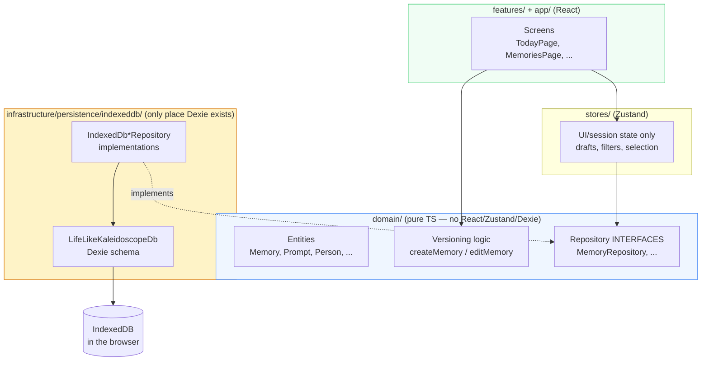
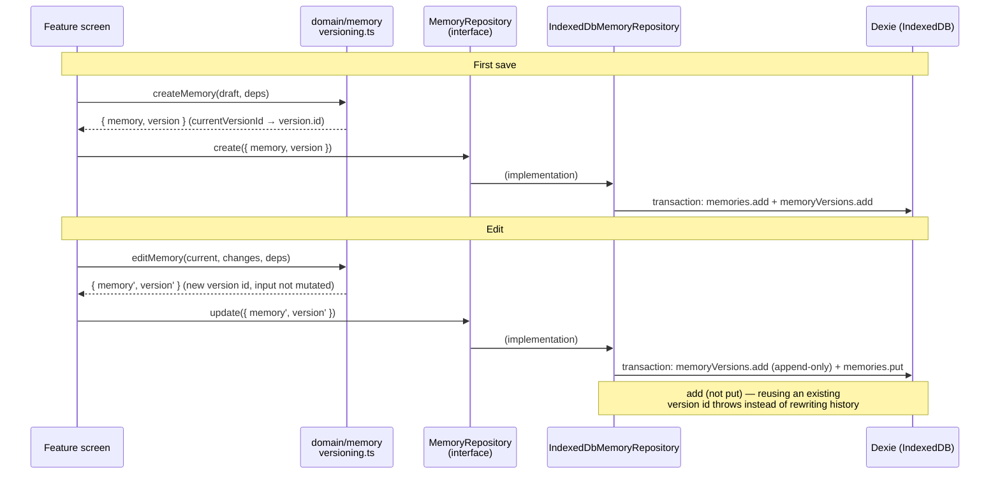

# Life Like Kaleidoscope — Architecture

This document is updated after each issue is completed. It explains what every file does, why it exists, and how the pieces connect.

Product context lives in `PROJECT_BRIEF.md`; the work queue lives in `docs/issues-priority.md`.

---

## System Overview

Life Like Kaleidoscope is a local-first daily memory journal: one single-word prompt per day, one small memory written about it, accumulated over years into a searchable, connected record of a life. Everything runs in the browser — no backend, no accounts, no telemetry. All data lives in the user's own IndexedDB.

The codebase follows Clean Architecture layering with feature-based folders:

**The one dependency rule that matters:** `domain/` imports nothing from React, Zustand, or Dexie. Features and stores talk to persistence only through the repository interfaces, so a future NestJS/PostgreSQL backend means writing `Api*Repository` implementations and swapping one factory call — nothing else changes.

---

## Data Flow — saving and editing a memory

Every save produces an immutable `MemoryVersion` — including the very first. This enforces the brief's hard constraint: **edits preserve history, always**.

---

## Module Reference

### Domain layer (`src/domain/`)

Pure TypeScript. Unit-testable with no DOM. If a file here ever needs `react`, `zustand`, or `dexie`, the logic belongs in `infrastructure/` or `features/` instead.

#### `src/domain/shared/index.ts`
**Why it exists:** Domain-wide primitives, and the seam that keeps domain logic deterministic in tests.

| Export | Purpose |
|--------|---------|
| `EntityId` | Type alias for entity ids (string; UUIDs at runtime). |
| `IsoDateString` | Type alias for ISO 8601 timestamps. |
| `GenerateId` / `Now` | Function types injected into domain logic (`VersioningDeps`) so tests can supply fixed ids/clocks. |
| `defaultGenerateId()` | `crypto.randomUUID()` — the production id source. |
| `nowIso()` | `new Date().toISOString()` — the production clock. |

#### `src/domain/memory/memory.ts`
**Why it exists:** The core entities of the whole product.

| Type | Purpose |
|------|---------|
| `Memory` | One written memory. `approxAge`/`approxYear` are optional — dates are never forced (hard constraint §2). `authoredBy`/`aboutWhom` exist for a future caregiver mode but are inert in the MVP UI. `currentVersionId` points at the latest version. |
| `MemorySnapshot` | `Omit<Memory, 'currentVersionId'>` — a memory's content frozen at one save. |
| `MemoryVersion` | Immutable record of one save: `{ id, memoryId, snapshot, editedAt }`. Never overwritten or deleted by a normal edit. |
| `Photo` | Photo metadata attached to a memory; the binary lives in blob storage under `blobRef`. |

#### `src/domain/memory/versioning.ts`
**Why it exists:** The "edits preserve history" constraint implemented as pure functions, testable without any storage.

| Export | Purpose |
|--------|---------|
| `MemoryDraft` | What the author provides on first write. `aboutWhom` defaults to `authoredBy`; collections default to `[]`. |
| `MemoryEdit` | `Partial` of only the editable fields — id, promptId, authoredBy, createdAt cannot change through an edit. |
| `VersioningDeps` | `{ generateId, now }` — injected id source and clock. |
| `createMemory(draft, deps)` | Returns `{ memory, version }` — the initial version snapshots the memory as first written, so history is complete from save one. |
| `editMemory(current, edit, deps)` | Returns `{ memory, version }` with a fresh version id and `updatedAt`. Does not mutate its input; never touches prior versions. |

#### `src/domain/memory/repository.ts`
**Why it exists:** The contracts persistence must fulfil, defined next to the entities they serve.

| Interface | Key methods |
|-----------|-------------|
| `MemoryRepository` | `create`/`update` take `MemoryWithVersion` and must persist memory + version atomically; `getById`, `getAll` (newest first), `getByPromptId` (annual reflection), `getVersions` (oldest first), `delete` (memory + entire history — distinct from editing). |
| `PhotoRepository` | `save(photo, blob)` atomically, `getById`, `getByMemoryId`, `getBlob(blobRef)`, `delete` (removes metadata + blob together). |

#### `src/domain/prompt/` (`prompt.ts`, `repository.ts`, `words.ts`, `daily-prompt.ts`)
**Why it exists:** The daily single-word cue is its own aggregate — prompts are issued over time and the same word can recur (that recurrence powers Epic 9's annual reflection).

| Export | Purpose |
|--------|---------|
| `Prompt` | `{ id, word, createdAt }`. |
| `PromptRepository` | `save`, `getById`, `getAll` (oldest first), `getByWord` — every issuance of a word, for the reflection callback. |
| `WORD_POOL` (added in #4) | ~200 curated single words — concrete, sensory nouns ("Bicycle", "Kitchen"), not abstractions. Data only. |
| `localDateKey(date)` (added in #4) | Local `YYYY-MM-DD` — the boundary for "today's" prompt. Local time on purpose: a memory written at 23:50 belongs to that evening. |
| `chooseDailyWord(args)` (added in #4) | Pure selection: FNV-1a hash of the date key indexes into the words not used within the no-repeat window (default 120 days), so a reload never reshuffles today's word. If every word is inside the window (tiny custom pools), falls back to the least-recently-used word instead of failing. |
| `getOrCreateTodaysPrompt(repo, deps)` (added in #4) | Idempotent per local day: returns today's existing prompt or chooses, persists, and returns a new one. Injected `generateId`/`now` keep it testable. |

#### `src/domain/person/index.ts` · `src/domain/place/index.ts` · `src/domain/tag/index.ts`
**Why they exist:** First-class graph nodes from day one (per the brief, retrofitting stable ids later is expensive). Each file holds the entity plus its repository interface: `save`, `getById`, `getAll`, `delete`.

#### `src/domain/user/index.ts`
**Why it exists:** `UserProfile` for the single MVP user. `legacyContact` is a reserved schema field only — no succession/sharing logic is built around it (deliberate; see brief §4). `UserProfileRepository` is `get()`/`save()` — singleton semantics, no id lookup needed. `ensureUserProfile()` (added in #4) silently creates the default profile on first save — the MVP never asks the user to sign up; the profile exists only so memories have an `authoredBy` id.

#### `src/domain/export/` (`backup.ts`, `facts.ts`, `markdown.ts`, `print-html.ts`, `restore.ts`) — added in #11, restore in #16
**Why it exists:** Export is serialization of domain data into open formats — pure TS over the repository interfaces (same pattern as `getOrCreateTodaysPrompt`), so the formats are unit-testable without a browser and reusable by import (#16). Restore lives in the same folder because it is the inverse of the same `BackupFile` shape — one shared schema, so the two can never drift apart.

| Export | Purpose |
|--------|---------|
| `BackupFile` / `BACKUP_SCHEMA_VERSION` | The lossless JSON backup shape: user profile, prompts, memories, **full version histories**, people, places, tags, and photos with their bytes inline (base64) — one self-contained file. `schemaVersion` (currently 1) is what import (#16) checks. |
| `BackupSources` | The seven repository interfaces export reads from — structurally satisfied by the app's `Repositories` bundle, but declared in domain so the layer boundary holds. |
| `collectBackup(sources, deps)` | Walks all repositories (versions via `getVersions` per memory, photo bytes via `getBlob`) into one `BackupFile`. Injected `now` keeps `exportedAt` deterministic in tests. A missing photo blob becomes `content: null` rather than failing the whole export. |
| `serializeBackup(backup)` | Pretty-printed JSON — the backup stays human-inspectable. |
| `backupToMarkdown(backup)` | One readable document, **oldest memory first** (a life reads forward): `## word — YYYY-MM-DD` headings, story verbatim (the author's own text is not escaped), detail bullets (When/People/Places/Tags) only where present. Dates use `localDateKey` — locale-free on purpose. |
| `backupToPrintHtml(backup)` | Self-contained printable HTML (inline serif styling, `break-inside: avoid` per memory, story text HTML-escaped). "Export to PDF" is the browser's print dialog over this document — no PDF library dependency. |
| `facts.ts` (internal) | Shared shaping for the two human-readable formats: resolves prompt words and people/place/tag names, orders memories, builds the detail lines — so Markdown and print/PDF can never disagree about what a memory says. |
| `backupFileSchema` / `parseBackup(text)` (added in #16) | The Zod mirror of `BackupFile`; `parseBackup`'s return type pins the schema to `BackupFile` at compile time so they cannot silently drift. Checks go outside-in (JSON → is it ours → format version → full shape) and every thrown message is written for the user — the UI shows it verbatim. |
| `summarizeBackup(backup)` / `BackupSummary` (added in #16) | Counts of every entity (versions and byte-less photos included) — what the import UI reports **before anything is written**. |
| `RestoreTarget` (added in #16) | The write half of restore, implemented by the persistence layer: `hasUserData()` (auto-created rows — today's prompt, the default profile — deliberately don't count) and `replaceAll(backup)` (atomic wholesale replacement). Sits beside, not inside, the per-entity repositories because no per-entity contract should offer "replace storage wholesale". |
| `restoreBackup(backup, target)` (added in #16) | MVP merge strategy: restore only into an empty app (id-collision skip/overwrite is a follow-up). Refuses with a clear message when user data exists; otherwise hands the backup to the target. |
| `base64ToBytes(base64)` (added in #16) | Inverse of the export's photo-byte encoding — rebuilds the blob bytes on restore. |

---

### Persistence layer (`src/infrastructure/persistence/`)

`indexeddb/` is the only folder allowed to import Dexie.

#### `storage-persistence.ts` — added in #17
**Why it exists:** IndexedDB is "best-effort" storage by default — browsers may evict it under storage pressure without the user doing anything, which is unacceptable for a decades-long archive. This module wraps `navigator.storage` so the rest of the app never touches the raw API.

| Export | Purpose |
|--------|---------|
| `requestPersistentStorage()` | `navigator.storage.persist()` — asks the browser to protect the origin's storage from eviction. Idempotent; called fire-and-forget in `main.tsx` on every app start. |
| `getStorageStatus()` | `persisted()` + `estimate()` → `StorageStatus` for the Settings screen. |
| `StorageStatus` | `{ persisted, usage, quota }`, each `null` when the browser won't say. |

Everything is best-effort and never throws (the API is absent in non-secure contexts and some browsers). This covers silent eviction only — the user explicitly clearing site data is what export (#11) + import (#16) are for.

#### `db.ts`
**Why it exists:** Single definition of the IndexedDB schema.

| Table | Indexes | Notes |
|-------|---------|-------|
| `prompts` | `id, word, createdAt` | `word` non-unique — same word can be issued in different years. |
| `memories` | `id, promptId, createdAt, updatedAt, *peopleIds, *placeIds, *tagIds` | Multi-entry indexes ready for search (Epic 6) and the graph (Epic 8). |
| `memoryVersions` | `id, memoryId, editedAt` | Append-only by convention, enforced in the repository. |
| `people` / `places` / `tags` | `id, name` / `id, name` / `id, label` | |
| `photos` | `id, memoryId` | |
| `photoBlobs` | `blobRef` | Stores `{ bytes: ArrayBuffer, type }`, **not** `Blob` — Blobs don't survive IndexedDB structured cloning reliably (notably older Safari). |
| `userProfiles` | `id` | Holds the single MVP profile. |

The constructor takes an optional db name so tests can isolate databases per test.

#### `memory-repository.ts` — `IndexedDbMemoryRepository`
**Why it exists:** Implements `MemoryRepository` with the versioning guarantees pushed down to the storage level.

Key decision: `update()` inserts the version with Dexie's `add` (not `put`) inside a read-write transaction — an id collision with an existing version **throws** instead of silently rewriting history. `delete()` removes the memory and its versions in one transaction.

#### `photo-repository.ts` — `IndexedDbPhotoRepository`
**Why it exists:** Implements `PhotoRepository`. Converts `Blob → ArrayBuffer` on save and reconstructs a `Blob` (with original mime type) on read, hiding the storage-portability workaround from the domain interface. Save and delete keep metadata and bytes consistent in a single transaction.

#### `prompt-repository.ts` / `person-repository.ts` / `place-repository.ts` / `tag-repository.ts` / `user-profile-repository.ts`
**Why they exist:** Straightforward implementations of their domain interfaces. Ordering conventions: prompts by `createdAt`, people/places by `name`, tags by `label`.

#### `restore-target.ts` — `IndexedDbRestoreTarget` (added in #16)
**Why it exists:** Implements `RestoreTarget`. `replaceAll` is one Dexie transaction that clears every table and writes the backup's rows — all-or-nothing, and the resulting database is exactly what export read, which is what makes the round-trip identical. Photo rows and blob rows are rebuilt before the transaction opens (Dexie aborts a transaction that waits on non-database work); a photo exported with `content: null` gets its metadata back but no invented blob. `hasUserData()` counts memories/people/places/tags/photos only — prompts and profiles are auto-created on app load and must not make a fresh browser look "occupied".

#### `index.ts`
**Why it exists:** The composition point for the whole persistence layer.

| Export | Purpose |
|--------|---------|
| `Repositories` | Interface bundling all seven repository interfaces plus the `RestoreTarget` (#16) — what the app "sees". |
| `createIndexedDbRepositories(dbName?)` | Builds one `LifeLikeKaleidoscopeDb` and wires all the implementations around it. A future remote backend replaces this one factory. |
| Class re-exports | Individual repositories, mainly for tests. |

---

### State layer (`src/stores/`) — added in #4

Zustand owns UI/session state only; persisted data always flows through the domain repository interfaces.

| File | Purpose |
|------|---------|
| `repositories.ts` | The app-wide persistence handle: lazy `getRepositories()` returning the `Repositories` bundle (IndexedDB-backed today), plus `setRepositories()` as the test seam. The one place that picks an implementation. |
| `daily-prompt-store.ts` | Today's prompt, the in-progress draft, today's saved memories, and `load`/`setDraft`/`save` actions. `load()` guards against concurrent invocation (React StrictMode double-runs effects in dev — without the guard, two racing `getOrCreateTodaysPrompt` calls each created a prompt; found by browser verification, not by tests). It also collects memories across **all** of today's prompts, healing any duplicate same-day prompt data. `save()` runs `ensureUserProfile` → `createMemory` → `MemoryRepository.create`. |
| `memories-store.ts` | All memories (newest first) plus a `promptsById` lookup so the list can show each memory's word. |

---

### Features (`src/features/`)

| File | Purpose |
|------|---------|
| `daily-prompt/TodayPage.tsx` (real since #4) | The heart of the app: date + today's word large and centered, a serif textarea ("A memory this word brings back"), and a single "Keep this memory" button (disabled while empty/saving — no error states for an empty page, per the no-guilt stance). Saved entries are echoed below with a link to the full list; writing more than once a day is allowed and unceremonious. |
| `memory-entry/MemoriesPage.tsx` (real since #4) | Newest-first cards — word, written-on date, three-line story excerpt — each linking to `/memories/:id`. Calm `EmptyState` pointing back to today's word when nothing exists; a "Write a memory" header action opens the full form (#5). |
| `memory-entry/memory-form.ts` (added in #5) | The full form's logic half: `memoryFormSchema` (Zod — only the story is required; age/year just have to be plausible integers when given), `parseNameList` (comma-separated names → trimmed, case-insensitively deduped), `memoryFieldsFromValues` (raw strings → `MemoryDraft`/`MemoryEdit` shapes), and `resolveEntityIds`, which reuses existing people/places/tags by name (case-insensitive) and creates the rest — graph nodes stay stable across memories. |
| `memory-entry/MemoryForm.tsx` (added in #5) | The shared form component (RHF + zodResolver) used by both the new and edit pages: title, story, approx age/year, and comma-separated people/places/tags, every field but the story optional ("an invitation, not a demand"). |
| `memory-entry/memory-context.ts` (added in #5) | `loadMemoryContext(id)` — one load for everything the memory pages show: the memory plus its prompt word and people/place/tag display names resolved from ids. |
| `memory-entry/MemoryNewPage.tsx` (added in #5) | `/memories/new` — the roomier sibling of the Today quick entry. Attaches the new memory to today's prompt through the daily-prompt store (so its StrictMode-safe guard keeps the day to one prompt), then navigates to the detail page. Reached from a Memories header action and a quiet link beside Today's save button. |
| `memory-entry/MemoryDetailPage.tsx` (real since #5) | The full story with When/People/Places/Tags rows (shown only when present), edit action, version-history link, and delete behind a quiet inline confirmation ("Keep it" as the easy way out). Unknown ids get the calm "This memory isn't here" empty state. |
| `memory-entry/MemoryEditPage.tsx` (real since #5) | Prefills `MemoryForm` from `loadMemoryContext`; saving goes through `editMemory` → `MemoryRepository.update`, appending a brand-new immutable `MemoryVersion` — never mutating in place. |
| `version-history/VersionHistoryPage.tsx` (added in #5) | `/memories/:id/history` — read-only cards, newest first, each version's snapshot as written, the current one marked. Nothing on this page can change or remove anything, which is the point. |
| `memory-entry/memory-form.test.ts` / `memory-entry/memory-crud.test.tsx` (added in #5) | Unit tests for the form logic (schema, name parsing, entity reuse) and a routed integration suite against fake-indexeddb: create through the full form → detail rows, story-required validation, edit → two versions in history with the old text kept, delete with confirmation removing the whole history, and not-found states. |
| `daily-prompt/vertical-slice.test.tsx` | The end-to-end slice as a test: word appears → type → save → echoed on Today → listed on Memories, against real stores + fake-indexeddb. Also regression tests for the StrictMode double-load race and the duplicate-prompt healing path. |
| `export/ExportPage.tsx` (real since #11) | Three calm cards — JSON backup (the lossless restore file), Markdown (readable, oldest first), PDF (opens the browser print dialog on the printable document; "Save as PDF" lives there). Collects a fresh `BackupFile` on each click via `getRepositories()`; per-format busy labels, a `role="alert"` message on failure or when a popup blocker eats the print window. No store — export is a one-shot action with no session state worth keeping. |
| `export/download.ts` | The browser-only delivery half, deliberately outside `domain/`: `downloadTextFile` (object URL + anchor click) and `openPrintDialog` (`window.open` → write → `print()`, returning `false` when popup-blocked so the page can explain). |
| `export/ImportBackupCard.tsx` (added in #16) | The read-it-back half of the JSON backup, a fourth card on the Export page. Two steps on purpose: choosing a file only parses/validates and reports what it holds ("nothing has been written yet"); restore runs only after an explicit confirm. Parse/restore errors surface verbatim in a `role="alert"` — they're written for the user in `restore.ts`. Success links to `/memories`. |
| Other `…Page.tsx` files | Still placeholders for their epics. |

---

### App shell & routing (`src/app/`, `src/App.tsx`)

| File | Purpose |
|------|---------|
| `src/App.tsx` | `createBrowserRouter` with the eight routes from brief §6 (`/`, `/memories`, `/memories/:id`, `/memories/:id/edit`, `/search`, `/graph`, `/export`, `/settings`) plus `/memories/new` and `/memories/:id/history` (#5), all nested under `AppShell`, plus a `*` catch-all → `NotFoundPage` (#23). `basename` follows `import.meta.env.BASE_URL` so routes resolve under the GitHub Pages subpath (#21). |
| `src/app/AppShell.tsx` | Responsive shell (reworked in #3/#14). Desktop (`sm+`): header with title + horizontal text nav. Phones: header shows the title only; navigation moves to a **fixed bottom tab bar** — six icon+label tabs (lucide icons), each ≥56px tall, `env(safe-area-inset-bottom)` padding, `main` gets `pb-28` so content clears the bar. Only one nav is in the accessibility tree at a time (the other is `display:none`). Verified at 390×844: no overflow, no clipping. |
| `src/main.tsx` | Entry point. Calls `requestPersistentStorage()` fire-and-forget before render (added in #17) so the browser can protect IndexedDB from silent eviction. |
| `src/app/SettingsPage.tsx` (real since #17) | "Your data" card: storage protection status + space used from `getStorageStatus()`, in a calm, informational tone (no alarm styling). When persistence is not granted, a dismissible "gentle suggestion" card points at the Export page for occasional backups — dismissal remembered in `localStorage`, no nagging. |
| `src/app/NotFoundPage.tsx` (added in #23) | Calm not-found screen for unknown routes — `EmptyState` inside the shell with a link back to Today. Replaces react-router's default developer error page, which became user-visible once the app was deployed (#21). |
| `src/features/*/…Page.tsx` | One placeholder screen per remaining route, in their future feature homes. |

`index.html` (updated in #15): title "Life Like Kaleidoscope", `theme-color` matching the paper background, and `public/favicon.svg` — a hand-drawn quiet notebook mark (ivory page, clay margin line, three trailing ink lines). Deliberately not literal kaleidoscope imagery (brief §2). The leftover bolt-logo `favicon.svg`/`icons.svg` from scaffolding were replaced/removed.

---

### Design system (`src/shared/ui/`) — added in #3

shadcn-style primitives, hand-written (new-york style, React 19 ref-as-prop, no `forwardRef`). Default button/input height is 44px — tap-target minimum as a design-system default rather than a per-screen fix. Prose inherits the serif body font; UI chrome (labels, buttons, nav) uses `font-sans`.

| File | Exports | Notes |
|------|---------|-------|
| `button.tsx` | `Button`, `buttonVariants` | cva variants: `default/secondary/outline/ghost/destructive`, sizes `sm/default/lg/icon`. Defaults to `type="button"`. |
| `card.tsx` | `Card` + `Header/Title/Description/Content/Footer` | Standard shadcn card family on the paper palette. |
| `text-field.tsx` | `TextField` | Labeled input with `hint`/`error`; wires `aria-invalid` + `aria-describedby`. Ids from `useId`. |
| `textarea.tsx` | `Textarea` | Same labeled-field pattern, serif prose area for memory writing. |
| `photo-upload.tsx` | `PhotoUpload` | Dashed drop-well `<label>` wrapping an `sr-only` native file input — keyboard/SR users get the real control. Resets after each pick; `onSelect(File[])`. |
| `empty-state.tsx` | `EmptyState` | Calm empty screen (icon/title/description/action) — deliberately no guilt copy. |
| `page-header.tsx` | `PageHeader` | `h1` + description + right-aligned action slot. |
| `PlaceholderPage.tsx` | `PlaceholderPage` | Now a thin wrapper over `EmptyState`. |
| `index.ts` | Barrel for all of the above. | |

---

### Shared (`src/shared/`)

| File | Purpose |
|------|---------|
| `lib/utils.ts` | `cn()` — `clsx` + `tailwind-merge`, the standard shadcn class-merging helper. |

`src/index.css` holds the theme: warm paper palette (oklch ivory/ink CSS variables mapped to Tailwind v4 `@theme inline` tokens, from Epic 0) plus, added in #3, `--font-serif` (Charter/Sitka/Cambria/Georgia stack — body default) and `--font-sans` (warm system sans for UI chrome). System stacks only — no webfont downloads, consistent with privacy-first.

---

### Tests

| File | Covers |
|------|--------|
| `src/domain/memory/versioning.test.ts` | Pure versioning logic: initial version on create, snapshot shape (no `currentVersionId`), defaults, no-mutation guarantee, edit chains, optional dates. |
| `src/infrastructure/persistence/indexeddb/repositories.test.ts` | All repositories against `fake-indexeddb`: round-trips, version append + tamper rejection, delete-with-history, prompt lookup by word, photo blob round-trip, singleton profile. Fresh db per test. |
| `src/shared/lib/utils.test.ts` | `cn()` behaviour. |
| `src/shared/ui/shared-ui.test.tsx` | Added in #3. Primitives via RTL: click/disabled `Button`, label association + error ARIA on `TextField`/`Textarea`, file selection through `PhotoUpload`, `EmptyState`/`PageHeader` render. |
| `src/app/AppShell.test.tsx` | Added in #3/#14. Shell renders title + outlet; every route present in both desktop nav and mobile tab bar. |

| `src/domain/prompt/daily-prompt.test.ts` | Added in #4. Determinism per date, window exclusion, LRU fallback, per-day idempotency, pool-vs-window sanity, timezone-safe date keys. |
| `src/infrastructure/persistence/storage-persistence.test.ts` | Added in #17. Stubs `navigator.storage`: persist grant/deny, all-null status when the API is missing, rejection tolerance. |
| `src/app/SettingsPage.test.tsx` | Added in #17. Status rendering per persistence state, suggestion only when not granted, dismissal sticks across visits. |
| `src/domain/export/export.test.ts` | Added in #11. Pure, against hand-rolled in-memory `BackupSources`: backup completeness incl. version histories, `null` (not dropped-key `undefined`) profile, photo-bytes base64 round-trip + missing-blob tolerance, JSON serialize/parse identity, Markdown ordering/headings/detail lines, HTML escaping and paragraph preservation. |
| `src/features/export/ExportPage.test.tsx` | Added in #11. The page against real repositories + fake-indexeddb, with `URL.createObjectURL`/anchor-click stubbed (jsdom has neither): JSON download parses back to the saved memory + version, Markdown contains the word heading, PDF path writes the document and calls `print()`, popup-blocked path shows the alert. |
| `src/domain/export/restore.test.ts` | Added in #16. Pure: serialize→parse identity, each rejection message (not JSON / not ours / newer format version / named broken field), summary counts, refusal over existing data, base64 inversion. |
| `src/infrastructure/persistence/indexeddb/restore-target.test.ts` | Added in #16. Against fake-indexeddb: the issue's acceptance test — export → fresh browser (with auto-created prompt/profile) → import → re-export equals the original; photo blob readable after restore; auto-created rows count as empty; refusal leaves existing data untouched. |

Test stack: Vitest + jsdom + `fake-indexeddb` (dev dependency). 84 tests as of #16.

**Browser verification:** `playwright-core` (dev dependency, added with #3) drives the built app in the system's Edge/Chrome (`channel:` launch — no browser binaries downloaded). Used for per-epic runtime verification: viewport checks at 390×844 and 1280×800, favicon/response checks, screenshots.

---

## Tooling

| Piece | Notes |
|-------|-------|
| Vite 8 + React 19 + TS strict | `verbatimModuleSyntax` and `erasableSyntaxOnly` are on — use `import type`, no constructor parameter properties or enums. |
| Tailwind CSS v4 (`@tailwindcss/vite`) | Theme tokens in `src/index.css` (`@theme` / `@theme inline`). |
| Path alias | `@/ → src/` (vite.config.ts, vitest.config.ts, tsconfig.app.json). |
| Scripts | `dev`, `build` (tsc + vite), `test` / `test:watch` / `test:coverage`, `lint` (oxlint), `format` (prettier), `type-check`. |

---

## Status

```mermaid
flowchart LR
    subgraph Done ["✅ Done"]
        E0["#1 Epic 0 — Scaffold & tooling"]
        E1["#2 Epic 1 — Domain model & persistence"]
        E2["#3 Epic 2 — Design system & shell"]
        B14["#14 Mobile nav bug"]
        B15["#15 Favicon"]
        E3["#4 Epic 3 — Daily Prompt slice"]
        PS["#17 Persistent storage + Settings status"]
        EX["#11 Epic 11 — Export (JSON / Markdown / print-to-PDF)"]
        IM["#16 JSON backup import/restore"]
        E4["#5 Epic 4 — Memory entry CRUD & version history"]
    end
    subgraph Next ["⏭ Next"]
        L10N["#18 Localization — Russian support (Tier 5)"]
    end
    Done --> Next
```

See `docs/issues-priority.md` for the full ordered queue.
