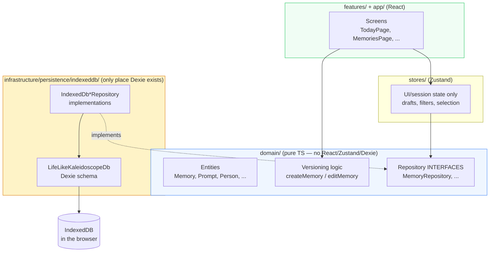
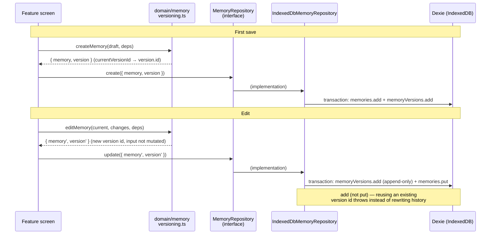

# Life Like Kaleidoscope — Architecture

This document is updated after each issue is completed. It explains what every file does, why it exists, and how the pieces connect.

Product context lives in `PROJECT_BRIEF.md`; the work queue lives in `docs/issues-priority.md`.

---

## System Overview

Life Like Kaleidoscope is a local-first daily memory journal: one single-word prompt per day, one small memory written about it, accumulated over years into a searchable, connected record of a life. Everything runs in the browser — no backend, no accounts, no telemetry. All data lives in the user's own IndexedDB.

The codebase follows Clean Architecture layering with feature-based folders:

```mermaid
flowchart TD
    subgraph UI ["features/ + app/  (React)"]
        A["Screens<br/>TodayPage, MemoriesPage, ..."]
    end
    subgraph State ["stores/  (Zustand)"]
        B["UI/session state only<br/>drafts, filters, selection"]
    end
    subgraph Domain ["domain/  (pure TS — no React/Zustand/Dexie)"]
        C["Entities<br/>Memory, Prompt, Person, ..."]
        D["Versioning logic<br/>createMemory / editMemory"]
        E["Repository INTERFACES<br/>MemoryRepository, ..."]
    end
    subgraph Infra ["infrastructure/persistence/indexeddb/  (only place Dexie exists)"]
        F["LifeLikeKaleidoscopeDb<br/>Dexie schema"]
        G["IndexedDb*Repository<br/>implementations"]
    end

    A --> B
    B --> E
    A --> D
    G -. implements .-> E
    G --> F
    F --> H[("IndexedDB<br/>in the browser")]

    style Domain fill:#eff6ff,stroke:#3b82f6
    style Infra fill:#fef3c7,stroke:#d97706
    style UI fill:#f0fdf4,stroke:#22c55e
```

**The one dependency rule that matters:** `domain/` imports nothing from React, Zustand, or Dexie. Features and stores talk to persistence only through the repository interfaces, so a future NestJS/PostgreSQL backend means writing `Api*Repository` implementations and swapping one factory call — nothing else changes.

---

## Data Flow — saving and editing a memory

Every save produces an immutable `MemoryVersion` — including the very first. This enforces the brief's hard constraint: **edits preserve history, always**.

```mermaid
sequenceDiagram
    participant UI as Feature screen
    participant V as domain/memory<br/>versioning.ts
    participant R as MemoryRepository<br/>(interface)
    participant I as IndexedDbMemoryRepository
    participant DB as Dexie (IndexedDB)

    Note over UI,DB: First save
    UI->>V: createMemory(draft, deps)
    V-->>UI: { memory, version }  (currentVersionId → version.id)
    UI->>R: create({ memory, version })
    R->>I: (implementation)
    I->>DB: transaction: memories.add + memoryVersions.add

    Note over UI,DB: Edit
    UI->>V: editMemory(current, changes, deps)
    V-->>UI: { memory', version' }  (new version id, input not mutated)
    UI->>R: update({ memory', version' })
    R->>I: (implementation)
    I->>DB: transaction: memoryVersions.add (append-only) + memories.put
    Note over I,DB: add (not put) — reusing an existing<br/>version id throws instead of rewriting history
```

---

## Module Reference

### Domain layer (`src/domain/`)

Pure TypeScript. Unit-testable with no DOM. If a file here ever needs `react`, `zustand`, or `dexie`, the logic belongs in `infrastructure/` or `features/` instead.

#### `src/domain/shared/index.ts`
**Why it exists:** Domain-wide primitives, and the seam that keeps domain logic deterministic in tests.

| Export | Purpose |
|--------|---------|
| `EntityId` | Type alias for entity ids (string; UUIDs at runtime). |
| `IsoDateString` | Type alias for ISO 8601 timestamps. |
| `GenerateId` / `Now` | Function types injected into domain logic (`VersioningDeps`) so tests can supply fixed ids/clocks. |
| `defaultGenerateId()` | `crypto.randomUUID()` — the production id source. |
| `nowIso()` | `new Date().toISOString()` — the production clock. |

#### `src/domain/memory/memory.ts`
**Why it exists:** The core entities of the whole product.

| Type | Purpose |
|------|---------|
| `Memory` | One written memory. `approxAge`/`approxYear` are optional — dates are never forced (hard constraint §2). `mood?: Mood` (since #26) is likewise optional and carries no color coding. `authoredBy`/`aboutWhom` exist for a future caregiver mode but are inert in the MVP UI. `currentVersionId` points at the latest version. |
| `Mood` (added in #26) | `'happy' \| 'bittersweet' \| 'neutral' \| 'sad'` — a closed set of quiet words, not a free-form field or a scale. No Dexie index; add one only if search/filter by mood is built (out of scope per the issue). |
| `MemorySnapshot` | `Omit<Memory, 'currentVersionId'>` — a memory's content frozen at one save. |
| `MemoryVersion` | Immutable record of one save: `{ id, memoryId, snapshot, editedAt }`. Never overwritten or deleted by a normal edit. |
| `Photo` | Photo metadata attached to a memory; the binary lives in blob storage under `blobRef`. |

#### `src/domain/memory/versioning.ts`
**Why it exists:** The "edits preserve history" constraint implemented as pure functions, testable without any storage.

| Export | Purpose |
|--------|---------|
| `MemoryDraft` | What the author provides on first write. `aboutWhom` defaults to `authoredBy`; collections default to `[]`. |
| `MemoryEdit` | `Partial` of only the editable fields — id, promptId, authoredBy, createdAt cannot change through an edit. |
| `VersioningDeps` | `{ generateId, now }` — injected id source and clock. |
| `createMemory(draft, deps)` | Returns `{ memory, version }` — the initial version snapshots the memory as first written, so history is complete from save one. |
| `editMemory(current, edit, deps)` | Returns `{ memory, version }` with a fresh version id and `updatedAt`. Does not mutate its input; never touches prior versions. |

#### `src/domain/memory/repository.ts`
**Why it exists:** The contracts persistence must fulfil, defined next to the entities they serve.

| Interface | Key methods |
|-----------|-------------|
| `MemoryRepository` | `create`/`update` take `MemoryWithVersion` and must persist memory + version atomically; `getById`, `getAll` (newest first), `getByPromptId` (annual reflection), `getVersions` (oldest first), `delete` (memory + entire history — distinct from editing). |
| `PhotoRepository` | `save(photo, blob)` atomically, `getById`, `getByMemoryId`, `getBlob(blobRef)`, `delete` (removes metadata + blob together). |

#### `src/domain/prompt/` (`prompt.ts`, `repository.ts`, `words.ts`, `daily-prompt.ts`, `blocklist.ts`, `custom-words.ts`)
**Why it exists:** The daily single-word cue is its own aggregate — prompts are issued over time and the same word can recur (that recurrence powers Epic 9's annual reflection).

| Export | Purpose |
|--------|---------|
| `Prompt` | `{ id, word, createdAt, skipped? }` — `skipped` (added in #27) marks an issuance replaced via "skip this word for now"; it stays in history rather than being deleted. |
| `PromptRepository` | `save`, `getById`, `getAll` (oldest first), `getByWord` — every issuance of a word, for the reflection callback. |
| `WORD_POOL` (added in #4) | ~200 curated single words — concrete, sensory nouns ("Bicycle", "Kitchen"), not abstractions. Data only. |
| `WORD_POOL_RU` / `getWordPool(locale)` / `Locale` (added in #18) | The Russian pool is **curated, not translated** — built independently around the same idea ("Lunchbox" carries no memory-weight in Russian; «Дача», «Электричка», «Подъезд» have no English equivalent). `getWordPool` keys the active pool off the two-value `Locale`, which lives here (not in `src/i18n/`) because pool selection is domain logic; the i18n layer re-exports it. |
| `localDateKey(date)` (added in #4) | Local `YYYY-MM-DD` — the boundary for "today's" prompt. Local time on purpose: a memory written at 23:50 belongs to that evening. |
| `chooseDailyWord(args)` (added in #4) | Pure selection: FNV-1a hash of the date key indexes into the words not used within the no-repeat window (default 120 days), so a reload never reshuffles today's word. If every word is inside the window (tiny custom pools), falls back to the least-recently-used word instead of failing. |
| `getOrCreateTodaysPrompt(repo, deps)` (added in #4; updated in #27) | Idempotent per local day: returns today's existing *non-skipped* prompt (the most recently issued one, so a skip's replacement wins over the original) or chooses, persists, and returns a new one. Injected `generateId`/`now` keep it testable. |
| `wordBelongsToLocale(word, locale, customWords)` (added in #34) | Whether `word` could have come from `locale`'s curated pool, or is one of the user's own custom words (#28, not locale-scoped — belongs everywhere). Lives in `words.ts`. Used to detect a word issued under a *different*, now-stale locale. |
| `skipTodaysPrompt(repo, current, deps)` (added in #27) | "Skip this word for now": marks `current` skipped and issues a replacement via `chooseDailyWord`, persisted. No special-casing needed to keep the skipped word out of the new pick — its issuance timestamp is still today, so the existing no-repeat-window logic excludes it on its own. |
| `pickTodaysWord(repo, current, word, deps)` (added in #31) | "…or choose a word yourself": same mechanic as `skipTodaysPrompt` (marks `current` skipped, issues a replacement, persisted), but the word is given rather than drawn via `chooseDailyWord` — the word gallery's deliberate pick. |
| `BlockedWord` / `BlockedWordRepository` (added in #27) | "Never show this word again": `{ id, word, locale, blockedAt }`, scoped per locale (blocking "Hospital" leaves «Больница» untouched — the #18 pools stay independent) with `save`/`remove`/`getAll`. |
| `excludeBlocked(pool, blocked, locale)` (added in #27) | A word pool with that locale's blocked words filtered out — applied at the call site (`daily-prompt-store.ts`) before `chooseDailyWord`/`skipTodaysPrompt` ever see the pool, rather than threading blocklist knowledge into the selection functions themselves. |
| `CustomWord` / `CustomWordRepository` (added in #28) | "Your words": `{ id, word, createdAt }` with `save`/`remove`/`getAll`. **Not** locale-scoped (unlike `BlockedWord`) — a custom word is whatever language the user wrote it in and is offered alongside either curated pool. |
| `isDuplicateWord(word, existing)` / `prepareCustomWord(raw, existing)` (added in #28) | Case-insensitive membership against `WORD_POOL`, `WORD_POOL_RU`, and the user's own custom words; `prepareCustomWord` trims and returns `null` for blank/duplicate input rather than throwing — adding a word is guided, never enforced with an error message. |

#### `src/domain/person/index.ts` · `src/domain/place/index.ts` · `src/domain/tag/index.ts`
**Why they exist:** First-class graph nodes from day one (per the brief, retrofitting stable ids later is expensive). Each file holds the entity plus its repository interface: `save`, `getById`, `getAll`, `delete`.

#### `src/domain/user/index.ts`
**Why it exists:** `UserProfile` for the single MVP user. `legacyContact` is a reserved schema field only — no succession/sharing logic is built around it (deliberate; see brief §4). `UserProfileRepository` is `get()`/`save()` — singleton semantics, no id lookup needed. `ensureUserProfile()` (added in #4) silently creates the default profile on first save — the MVP never asks the user to sign up; the profile exists only so memories have an `authoredBy` id.

#### `src/domain/export/` (`backup.ts`, `facts.ts`, `markdown.ts`, `print-html.ts`, `restore.ts`) — added in #11, restore in #16
**Why it exists:** Export is serialization of domain data into open formats — pure TS over the repository interfaces (same pattern as `getOrCreateTodaysPrompt`), so the formats are unit-testable without a browser and reusable by import (#16). Restore lives in the same folder because it is the inverse of the same `BackupFile` shape — one shared schema, so the two can never drift apart.

| Export | Purpose |
|--------|---------|
| `BackupFile` / `BACKUP_SCHEMA_VERSION` | The lossless JSON backup shape: user profile, prompts, memories, **full version histories**, people, places, tags, photos with their bytes inline (base64), blocked words (#27), and custom words (#28) — one self-contained file. `schemaVersion` (currently 1) is what import (#16) checks. |
| `BackupSources` | The nine repository interfaces export reads from — structurally satisfied by the app's `Repositories` bundle, but declared in domain so the layer boundary holds. |
| `collectBackup(sources, deps)` | Walks all repositories (versions via `getVersions` per memory, photo bytes via `getBlob`) into one `BackupFile`. Injected `now` keeps `exportedAt` deterministic in tests. A missing photo blob becomes `content: null` rather than failing the whole export. |
| `serializeBackup(backup)` | Pretty-printed JSON — the backup stays human-inspectable. |
| `backupToMarkdown(backup)` | One readable document, **oldest memory first** (a life reads forward): `## word — YYYY-MM-DD` headings, story verbatim (the author's own text is not escaped), detail bullets (When/Mood/People/Places/Tags — Mood added in #26) only where present. Dates use `localDateKey` — locale-free on purpose. |
| `backupToPrintHtml(backup)` | Self-contained printable HTML (inline serif styling, `break-inside: avoid` per memory, story text HTML-escaped). "Export to PDF" is the browser's print dialog over this document — no PDF library dependency. |
| `facts.ts` (internal) | Shared shaping for the two human-readable formats: resolves prompt words and people/place/tag names, orders memories, builds the detail lines — so Markdown and print/PDF can never disagree about what a memory says. |
| `backupFileSchema` / `parseBackup(text)` (added in #16) | The Zod mirror of `BackupFile`; `parseBackup`'s return type pins the schema to `BackupFile` at compile time so they cannot silently drift. Checks go outside-in (JSON → is it ours → format version → full shape) and every thrown message is written for the user — the UI shows it verbatim. `mood` (since #26) is mirrored as `z.enum(['happy', 'bittersweet', 'neutral', 'sad']).optional()` — a hand-maintained duplicate of the domain `Mood` union, same as every other field here. |
| `summarizeBackup(backup)` / `BackupSummary` (added in #16) | Counts of every entity (versions and byte-less photos included) — what the import UI reports **before anything is written**. |
| `RestoreTarget` (added in #16) | The write half of restore, implemented by the persistence layer: `hasUserData()` (auto-created rows — today's prompt, the default profile — deliberately don't count) and `replaceAll(backup)` (atomic wholesale replacement). Sits beside, not inside, the per-entity repositories because no per-entity contract should offer "replace storage wholesale". |
| `restoreBackup(backup, target)` (added in #16) | MVP merge strategy: restore only into an empty app (id-collision skip/overwrite is a follow-up). Refuses with a clear message when user data exists; otherwise hands the backup to the target. |
| `base64ToBytes(base64)` (added in #16) | Inverse of the export's photo-byte encoding — rebuilds the blob bytes on restore. |

#### `src/domain/search/index.ts` — added in #7
**Why it exists:** Free-text search over names/labels isn't something the `memories` table's multi-entry indexes (`*peopleIds`/`*placeIds`/`*tagIds`) can do directly — those support exact-id lookups, not substring text matching — so this is a pure, storage-free filter over an already-loaded set, kept in `domain/` so it's unit-testable without a browser.

| Export | Purpose |
|--------|---------|
| `SearchContext` | The id→name/label lookups a search needs: `wordByPromptId`, `nameByPersonId`, `nameByPlaceId`, `labelByTagId`. Built once per search session by the page, not by this module. |
| `searchMemories(memories, query, ctx)` | Case-insensitive substring match across a memory's prompt word, title, story, and its linked people/place/tag names. A blank (or all-whitespace) query returns `[]`, not the whole archive — deliberately, so the page can distinguish "nothing typed yet" from "typed and found nothing". |

#### `src/domain/timeline/index.ts` — added in #8
**Why it exists:** "Ordered by when the event happened" needs a chronological sort key, but a memory's only absolute-time field is `approxYear` — `approxAge` alone can't be placed on the same axis (this app doesn't collect a birth year), so a memory with only an age genuinely cannot be merged into a year-sorted list without inventing data.

| Export | Purpose |
|--------|---------|
| `Timeline` / `TimelineYearGroup` | `{ byYear: { year, memories }[], undated: Memory[] }`. |
| `buildTimeline(memories)` | Groups by `approxYear` ascending ("a life reads forward", same phrase as the Markdown export's ordering); memories within a year sort by write date. Anything with no `approxYear` — whether or not it has an `approxAge` — goes to `undated`, sorted by `approxAge` ascending when given (age-known before age-unknown), then by write date. Nothing is ever dropped for lacking dates. |

#### `src/domain/memory-graph/index.ts` — added in #9
**Why it exists:** The graph's *data model*, deliberately separated from layout/rendering (`features/memory-graph/graph-layout.ts`) — the domain shouldn't know about pixels, and a future richer explorer can reuse this unchanged even if the render is rebuilt from scratch.

| Export | Purpose |
|--------|---------|
| `GraphNode` / `GraphEdge` / `MemoryGraph` | `{ id, type, label }` nodes (`type` is `'memory' \| 'person' \| 'place' \| 'tag'`), `{ source, target }` edges by node id, and the `{ nodes, edges }` pair. Node ids are type-prefixed (`memory:<id>`) so a node's kind reads off the id alone. |
| `buildMemoryGraph(memories, wordByPromptId, people, places, tags)` | One node per memory (even one sharing nothing yet), plus one node per person/place/tag that at least one memory actually references — an unreferenced one would just be clutter. An edge connects a memory to each of its own people/places/tags; entities are never linked to each other directly, only through the memories between them, which is the whole "shared reference" relationship for this basic pass. A memory's label falls back word → title → a 24-char story excerpt when no prompt is found. |

#### `src/domain/annual-reflection/index.ts` — added in #10
**Why it exists:** "This word came around about a year ago, too" — the callback the `PromptRepository.getByWord` method and the `words.ts` comment ("words may repeat across years") were already anticipating. The daily draw is never deliberately tied to the calendar, so a same-word issuance landing near the anniversary is coincidental; this module only decides whether one did, pure and storage-free.

| Export | Purpose |
|--------|---------|
| `ANNUAL_REFLECTION_TOLERANCE_DAYS` | `14` — how far from exactly one year ago a same-word issuance still counts as "the" anniversary. |
| `findAnniversaryPrompt(pastIssuances, today, toleranceDays?)` | Among a word's other issuances, returns the one closest to exactly one year before `today`, if any fall within the tolerance window — `undefined` otherwise. Today's own issuance would never match anyway (~365 days outside any reasonable tolerance) — the store's call site filters it out first regardless, for clarity at the call site rather than correctness. |

#### `src/domain/random-memory/index.ts` — added in #13
**Why it exists:** Serendipitous surfacing, independent of today's prompt word — "on this day" keys off a memory's *write* date (`createdAt`), the only field with day-level precision (`approxYear`/`approxAge` don't have one), which is what actually lets "the same calendar day, a past year" be detected at all.

| Export | Purpose |
|--------|---------|
| `onThisDayMemories(memories, today)` | Memories whose `createdAt` falls on the same month/day as `today`, from any earlier year — excludes anything written today itself. |
| `pickRandomMemory(memories, today, excludeIds?)` | "On this day" if the archive has one, else a random pick from everything else (excluding today's own new entries and any id already surfaced elsewhere, e.g. the annual-reflection callback). Both picks are hash-based on the local date — same FNV-1a approach `chooseDailyWord` uses — so the choice is stable across reloads within a day but changes day to day, never `undefined` unless the archive (minus exclusions) is empty. |

---

### Persistence layer (`src/infrastructure/persistence/`)

`indexeddb/` is the only folder allowed to import Dexie.

#### `storage-persistence.ts` — added in #17
**Why it exists:** IndexedDB is "best-effort" storage by default — browsers may evict it under storage pressure without the user doing anything, which is unacceptable for a decades-long archive. This module wraps `navigator.storage` so the rest of the app never touches the raw API.

| Export | Purpose |
|--------|---------|
| `requestPersistentStorage()` | `navigator.storage.persist()` — asks the browser to protect the origin's storage from eviction. Idempotent; called fire-and-forget in `main.tsx` on every app start. |
| `getStorageStatus()` | `persisted()` + `estimate()` → `StorageStatus` for the Settings screen. |
| `StorageStatus` | `{ persisted, usage, quota }`, each `null` when the browser won't say. |

Everything is best-effort and never throws (the API is absent in non-secure contexts and some browsers). This covers silent eviction only — the user explicitly clearing site data is what export (#11) + import (#16) are for.

#### `db.ts`
**Why it exists:** Single definition of the IndexedDB schema.

| Table | Indexes | Notes |
|-------|---------|-------|
| `prompts` | `id, word, createdAt` | `word` non-unique — same word can be issued in different years. |
| `memories` | `id, promptId, createdAt, updatedAt, *peopleIds, *placeIds, *tagIds` | Multi-entry indexes ready for search (Epic 6) and the graph (Epic 8). |
| `memoryVersions` | `id, memoryId, editedAt` | Append-only by convention, enforced in the repository. |
| `people` / `places` / `tags` | `id, name` / `id, name` / `id, label` | |
| `photos` | `id, memoryId` | |
| `photoBlobs` | `blobRef` | Stores `{ bytes: ArrayBuffer, type }`, **not** `Blob` — Blobs don't survive IndexedDB structured cloning reliably (notably older Safari). |
| `userProfiles` | `id` | Holds the single MVP profile. |
| `blockedWords` (added in #27) | `id, word, locale` | "Never show this word again" list. Added in a `version(2).stores()` call — Dexie leaves stores unmentioned in a version untouched, so this is purely additive over #1's schema. |
| `customWords` (added in #28) | `id, word` | "Your words" list. Added in `version(3).stores()`, same additive pattern. |

The constructor takes an optional db name so tests can isolate databases per test.

#### `memory-repository.ts` — `IndexedDbMemoryRepository`
**Why it exists:** Implements `MemoryRepository` with the versioning guarantees pushed down to the storage level.

Key decision: `update()` inserts the version with Dexie's `add` (not `put`) inside a read-write transaction — an id collision with an existing version **throws** instead of silently rewriting history. `delete()` removes the memory and its versions in one transaction.

#### `photo-repository.ts` — `IndexedDbPhotoRepository`
**Why it exists:** Implements `PhotoRepository`. Converts `Blob → ArrayBuffer` on save and reconstructs a `Blob` (with original mime type) on read, hiding the storage-portability workaround from the domain interface. Save and delete keep metadata and bytes consistent in a single transaction.

#### `prompt-repository.ts` / `person-repository.ts` / `place-repository.ts` / `tag-repository.ts` / `user-profile-repository.ts` / `blocked-word-repository.ts` / `custom-word-repository.ts`
**Why they exist:** Straightforward implementations of their domain interfaces. Ordering conventions: prompts by `createdAt`, people/places by `name`, tags by `label`. `blocked-word-repository.ts` (added in #27) and `custom-word-repository.ts` (added in #28) are both plain `save`/`remove`/`getAll` over their respective tables, no ordering guarantee.

#### `restore-target.ts` — `IndexedDbRestoreTarget` (added in #16)
**Why it exists:** Implements `RestoreTarget`. `replaceAll` is one Dexie transaction that clears every table and writes the backup's rows — all-or-nothing, and the resulting database is exactly what export read, which is what makes the round-trip identical. Photo rows and blob rows are rebuilt before the transaction opens (Dexie aborts a transaction that waits on non-database work); a photo exported with `content: null` gets its metadata back but no invented blob. `hasUserData()` counts memories/people/places/tags/photos, and (since #27/#28) blocked and custom words — prompts and profiles are auto-created on app load and must not make a fresh browser look "occupied", but a blocked or custom word is always a deliberate user action.

#### `index.ts`
**Why it exists:** The composition point for the whole persistence layer.

| Export | Purpose |
|--------|---------|
| `Repositories` | Interface bundling all nine repository interfaces (including `blockedWords` #27 and `customWords` #28) plus the `RestoreTarget` (#16) — what the app "sees". |
| `createIndexedDbRepositories(dbName?)` | Builds one `LifeLikeKaleidoscopeDb` and wires all the implementations around it. A future remote backend replaces this one factory. |
| Class re-exports | Individual repositories, mainly for tests. |

---

### State layer (`src/stores/`) — added in #4

Zustand owns UI/session state only; persisted data always flows through the domain repository interfaces.

| File | Purpose |
|------|---------|
| `repositories.ts` | The app-wide persistence handle: lazy `getRepositories()` returning the `Repositories` bundle (IndexedDB-backed today), plus `setRepositories()` as the test seam. The one place that picks an implementation. |
| `daily-prompt-store.ts` | Today's prompt, the in-progress draft (`draft`, plus `draftApproxAge`/`draftApproxYear` since #25 and `draftMood` since #26), today's saved memories, and `load`/`setDraft`/`setDraftApproxAge`/`setDraftApproxYear`/`setDraftMood`/`save` actions. `load()` guards against concurrent invocation (React StrictMode double-runs effects in dev — without the guard, two racing `getOrCreateTodaysPrompt` calls each created a prompt; found by browser verification, not by tests). It also collects memories across **all** of today's prompts, healing any duplicate same-day prompt data. `save()` no-ops (same as an empty story) if the approx age/year draft is out of range, then runs `ensureUserProfile` → `createMemory` → `MemoryRepository.create`, and clears all four draft fields on success. Since #27: a module-level `effectiveWordPool(locale)` helper (locale's pool minus `excludeBlocked`) feeds every word-pool read — `load()`, and the two new actions `skipPrompt()` (calls `skipTodaysPrompt`, clears the draft) and `blockWord()` (saves a `BlockedWord` for the current word, then delegates to `skipPrompt()`). A `skipping` boolean tracks either action in flight. Since #28: `effectiveWordPool` also concatenates every `CustomWord` onto the curated pool before `excludeBlocked` runs, so "Your words" join the same daily draw and are subject to the same blocklist. Since #31: `effectiveWordPool` is exported (the word gallery reuses it verbatim, so the gallery and the daily draw can never disagree about what's "effective") and a new `chooseWord(word)` action calls `pickTodaysWord`, no-ops if `word` already matches today's prompt, and otherwise clears the draft the same way `skipPrompt` does. Since #34: `load()` gates the #18 freeze on whether a memory exists yet, not merely on "a prompt was already issued today" — after resolving `todaysMemories`, if it's still empty it checks `wordBelongsToLocale(prompt.word, locale, customWords)`; a mismatch (the word was drawn under a different, now-stale locale) calls `skipTodaysPrompt` with the *current* locale's pool to redraw it. No cross-store subscription needed — the check re-runs naturally whenever `load()` does (component mount, e.g. navigating back to Today after switching languages in Settings), and is a no-op once a memory exists or the word already matches. Since #10: a new `lastYearMemories: Memory[]` field, populated by the module-level `loadAnnualReflection` helper (`prompts.getByWord` → `findAnniversaryPrompt` → `memories.getByPromptId` on a match) — called from `load()` only once `todaysMemories` is non-empty, and again at the end of `save()` right after the memory is persisted, so the reveal always reflects "has today's word already been written to", never a preview. `skipPrompt`/`chooseWord` reset it to `[]` alongside the other draft fields — defensive, since those actions are only reachable while `todaysMemories` is still empty anyway. Since #13: a matching `randomMemory: RandomMemoryPick | null` field, populated the same way (`load()` once `todaysMemories` is non-empty, again at the end of `save()`) via a module-level `loadRandomMemory` helper wrapping `pickRandomMemory` — passed the ids already in `lastYearMemories` as `excludeIds`, so the two callbacks never show the same memory twice on the same visit. |
| `memories-store.ts` | All memories (newest first) plus a `promptsById` lookup so the list can show each memory's word. |
| `locale-store.ts` (added in #18) | The active UI language and its dictionary. Reads the initial locale synchronously (`localStorage` choice, else `navigator.language`) so the first paint is already in the right language — no IndexedDB round-trip, no flash. `setLocale` persists the choice, updates `<html lang>`, and swaps the dictionary; it never touches issued prompts or memories. |

---

### Localization (`src/i18n/`) — added in #18

A minimal typed dictionary module, not an i18n framework — the string surface is small, and the `Dictionary` interface makes a missing Russian key a **compile error** instead of a silent English fallback.

| File | Purpose |
|------|---------|
| `dictionary.ts` | The `Dictionary` interface: every user-facing string in the app, grouped per screen. Parameterized strings are typed functions (`errorSaving(error)`, `versionNumber(n)`), so word order is free to differ between languages. |
| `en.ts` / `ru.ts` | The two dictionaries. Russian is translated for tone, not word-for-word — the same quiet notebook voice, no bureaucratic register. The `mood` namespace (#26) is the clearest example: the four values are curated Russian words chosen for tone (e.g. `neutral` → «спокойное», "calm", not the clinical «нейтральное»), not literal translations — same spirit as the curated (not translated) Russian prompt-word pool from #18. |
| `plural.ts` | `pluralEn` (one/many) and `pluralRu` (CLDR one/few/many — «1 год, 2 года, 5 лет»), used inside the dictionaries so count phrasing stays a dictionary concern. |
| `locale.ts` | `detectLocale` (from `navigator.language`), `read`/`saveStoredLocale` (localStorage, throw-tolerant), `localeTag` (`en` → `en-US` for `toLocaleDateString`), `applyDocumentLanguage` (keeps `<html lang>` honest for assistive tech). |
| `i18n.test.ts` (added in #18) | Plural rules incl. the Russian teens/tens edge cases (11 vs 21, 12–14 vs 22–24), locale persistence round-trip + garbage tolerance, browser detection, `<html lang>` sync. |

Every screen reads strings via `useLocaleStore((s) => s.dictionary)`. Deliberately **not** localized: exported Markdown/print documents (long-lived archives with `localDateKey` dates — stable regardless of later language switches, noted "locale-free on purpose" in the export design) and the restore error messages written in `domain/export/restore.ts` (the domain writes them verbatim for the UI; localizing them means an error-code contract — a follow-up if wanted).

---

### Features (`src/features/`)

| File | Purpose |
|------|---------|
| `daily-prompt/TodayPage.tsx` (real since #4) | The heart of the app: date + today's word large and centered, a serif textarea ("A memory this word brings back"), and a single "Keep this memory" button (disabled while empty/saving — no error states for an empty page, per the no-guilt stance). Saved entries are echoed below with a link to the full list; writing more than once a day is allowed and unceremonious. Since #25, a quiet "When was this, roughly?" toggle below the textarea reveals two optional numeric fields (approx age / approx year) reusing `memory-entry/memory-form.ts`'s `TextField` pattern, i18n copy, and range validation (`intInRangeError`) — collapsed by default so it never competes with the writing itself; "Keep this memory" stays disabled only while a filled-in age/year is out of range, not merely because the fields are empty. Since #26, a `ChipGroup` of four mood words ("How does this memory feel?") sits directly under the textarea, always visible (unlike the collapsed "when" toggle) — optional, no color coding. Since #27: under the word, a quiet "This word isn't landing today? Try another" link (hidden once a memory exists for today, via `todaysMemories.length === 0`) calls the store's `skipPrompt()`; a smaller "Never show this word again" link is revealed only *after* a skip (local `hasSkipped` state — a deliberate second step, never a sibling of skip on first sight) and calls `blockWord()`. Since #31: alongside "try another", a quiet "…or choose a word yourself" link to `/today/words` (same `todaysMemories.length === 0` visibility rule) opens the word gallery. Since #10: a "last year" section — same card styling as "Kept today" — renders below it whenever `lastYearMemories` is non-empty, headed by a quiet "This word came around about a year ago, too —" line; invisible until a memory exists for today's word, by construction (the store only ever populates `lastYearMemories` once `todaysMemories` does). Since #13: one more section below that, shown when `randomMemory` is set — heading text branches on `randomMemory.onThisDay` ("N years ago today, you wrote —", N computed from the memory's `createdAt` year vs. this year, vs. a plain "From your archive —" for the fallback pick). Same reveal-after-writing gate as #9, and the two callbacks are mutually exclusive by content (the store excludes `lastYearMemories`' ids from the `randomMemory` pick) even though they can both be visible at once. |
| `daily-prompt/WordGalleryPage.tsx` (added in #31) | `/today/words` — every word in `effectiveWordPool(locale)` (curated + custom, minus hidden), alphabetical (`localeCompare` with the locale's BCP-47 tag), plain text, no used/unused indicators per the design's calm stance. Tapping a word calls the store's `chooseWord(word)` then navigates back to `/`. A quiet "Back to today's word" link covers browsing away without picking. Reached only by deliberate navigation — never linked from anywhere that could spoil the daily surprise by accident. |
| `memory-entry/MemoriesPage.tsx` (real since #4) | Newest-first cards — word, written-on date, three-line story excerpt — each linking to `/memories/:id`. Calm `EmptyState` pointing back to today's word when nothing exists; a "Write a memory" header action opens the full form (#5). Since #8 (Epic 7): a "List"/"Timeline" radiogroup toggle (local component state, resets on remount — no store, matches `/memories` in the brief's routing table: "list/timeline view" is one screen, two presentations). Timeline mode renders `buildTimeline`'s groups as `<h2>` year headings, oldest first, each card's subtitle swapped from "written on" to "around age N" (when given) since the year heading already carries the date; an "Undated" section (shown only when non-empty) covers memories with no `approxYear` at all. |
| `memory-entry/memory-form.ts` (added in #5) | The full form's logic half: `makeMemoryFormSchema` (Zod — only the story is required; age/year just have to be plausible integers when given; a factory since #18, taking its validation messages from the active dictionary), `parseNameList` (comma-separated names → trimmed, case-insensitively deduped), `memoryFieldsFromValues` (raw strings → `MemoryDraft`/`MemoryEdit` shapes), and `resolveEntityIds`, which reuses existing people/places/tags by name (case-insensitive) and creates the rest — graph nodes stay stable across memories. Since #25, the range check underlying `makeMemoryFormSchema`'s age/year rules is also exposed standalone as `intInRangeError` (plus the raw-string→`number\|undefined` helper `optionalNumber`), so `daily-prompt-store.ts` can validate/parse the same two fields on the Today quick entry without depending on the full Zod schema. Since #26, `MemoryFormValues.mood` is a raw string ('' or a `Mood`) unconditionally accepted by the schema — the `ChipGroup` UI is what actually constrains it to a valid value — and `memoryFieldsFromValues` casts non-blank values to `Mood`. |
| `memory-entry/MemoryForm.tsx` (added in #5) | The shared form component (RHF + zodResolver) used by both the new and edit pages: title, story, approx age/year, mood chips (#26, via a `Controller`-wrapped `ChipGroup` since chips don't fit RHF's `register()` pattern), and comma-separated people/places/tags, every field but the story optional ("an invitation, not a demand"). Since #6 (Epic 5): a "Photos" section — `initialPhotos` prop (already-saved photos, edit only) previewed via `usePhotoPreviews`, plus locally-managed `newDrafts` (files picked via `PhotoUpload`, each with its own `URL.createObjectURL` preview) and `removedExistingIds`. Every thumbnail gets a small "×" remove control; on submit the form derives `PhotoChanges` (`newFiles`, `removedPhotoIds`) and passes it alongside the usual form values — persistence is left to the calling page, same division of labor as `resolveEntityIds`. |
| `memory-entry/memory-context.ts` (added in #5) | `loadMemoryContext(id)` — one load for everything the memory pages show: the memory plus its prompt word, people/place/tag display names resolved from ids, and (since #6) its `Photo[]`. |
| `memory-entry/MemoryNewPage.tsx` (added in #5) | `/memories/new` — the roomier sibling of the Today quick entry. Attaches the new memory to today's prompt through the daily-prompt store (so its StrictMode-safe guard keeps the day to one prompt), then navigates to the detail page. Reached from a Memories header action and a quiet link beside Today's save button. Since #6: photo ids are allocated (`allocatePhotos`) *before* `createMemory` runs, so the memory's first version already carries the final `photoIds` — same reasoning as resolving people/place/tag ids first; the blobs themselves are saved (`persistPhotos`) right after `memories.create` succeeds, once the real memory id exists. |
| `memory-entry/MemoryDetailPage.tsx` (real since #5) | The full story with When/Mood/People/Places/Tags rows (shown only when present; Mood added in #26, rendered as plain text via `t.mood[memory.mood]` — no color coding), edit action, version-history link, and delete behind a quiet inline confirmation ("Keep it" as the easy way out). Unknown ids get the calm "This memory isn't here" empty state. Since #6: a photo gallery (`usePhotoPreviews(context.photos)`) renders right after the story, before the detail rows — plain thumbnails, no captions UI (the domain field exists but nothing in this pass writes one). |
| `memory-entry/MemoryEditPage.tsx` (real since #5) | Prefills `MemoryForm` from `loadMemoryContext`; saving goes through `editMemory` → `MemoryRepository.update`, appending a brand-new immutable `MemoryVersion` — never mutating in place. Since #6: new photo blobs are saved *before* the memory update (so a later failure can't reference a photo id that doesn't exist), the final `photoIds` (kept existing + new) go into the edit payload, and removed photos are only deleted *after* the update succeeds (so a failed update never strands the memory referencing an already-gone photo). |
| `photos/photo-changes.ts` (added in #6) | `allocatePhotos(files, generateId)` / `persistPhotos(repo, memoryId, allocations)` — the New/Edit pages' shared photo-persistence orchestration, mirroring `memory-form.ts`'s `resolveEntityIds` split between pure allocation and IO. `blobRef` reuses the photo's own id — no separate value needed. `PhotoChanges` is the shape `MemoryForm` reports on submit. |
| `shared/hooks/use-photo-previews.ts` (added in #6) | `usePhotoPreviews(photos)` — fetches each photo's blob and returns `{ id, url, caption }` object-URL previews, revoking them on unmount and whenever the photo list changes. Shared by `MemoryForm` (existing photos) and `MemoryDetailPage` (display) — object URLs are a browser resource with their own lifecycle, which is why this lives in a hook rather than a store. |
| `version-history/VersionHistoryPage.tsx` (added in #5) | `/memories/:id/history` — read-only cards, newest first, each version's snapshot as written, the current one marked. Nothing on this page can change or remove anything, which is the point. |
| `memory-entry/memory-form.test.ts` / `memory-entry/memory-crud.test.tsx` (added in #5) | Unit tests for the form logic (schema, name parsing, entity reuse) and a routed integration suite against fake-indexeddb: create through the full form → detail rows, story-required validation, edit → two versions in history with the old text kept, delete with confirmation removing the whole history, and not-found states. Since #26, the create flow also taps a mood chip and asserts it lands on the detail page's Mood row. Since #6: `URL.createObjectURL`/`revokeObjectURL` are stubbed (jsdom has neither, same pattern as `ExportPage.test.tsx`); create-with-photo shows a preview in the form and the same photo on the detail page afterward; edit removes the seeded photo and adds a new one, landing on exactly one `Photo` row that isn't the original id. |
| `photos/photo-changes.test.ts` (added in #6) | `allocatePhotos` assigns a generated id per file (and is a no-op on an empty list); `persistPhotos` saves each allocation under the given memory id with `blobRef === id`, against a hand-rolled fake `PhotoRepository`. |
| `src/domain/search/search.test.ts` (added in #7) | Pure `searchMemories`: blank/whitespace query → `[]`; matches story and title case-insensitively; matches the prompt word, a linked person, place, or tag via the context lookup; excludes a memory that matches nothing. |
| `src/features/search/SearchPage.test.tsx` (added in #7) | Against fake-indexeddb: shows the "start typing" invitation before any query; matches a story substring case-insensitively; matches a linked person/place/tag; shows the calm "Nothing found" empty state for a query that matches nothing. |
| `src/domain/timeline/timeline.test.ts` (added in #8) | Pure `buildTimeline`: groups by year ascending; multiple memories under one year ordered by write date; no-`approxYear` memories land in `undated` rather than being dropped; `undated` orders by `approxAge` ascending (age-known before age-unknown); empty input → empty groups. |
| `src/domain/memory-graph/memory-graph.test.ts` (added in #9) | Pure `buildMemoryGraph`: a node per memory even with no shared references; label falls back word → title → story excerpt; a memory's people/places/tags each get a node and an edge; an unreferenced person/place/tag is omitted; a hub shared by two memories is one node with one edge per memory; empty input → empty graph. |
| `src/features/memory-graph/graph-layout.test.ts` (added in #9) | Pure `layoutMemoryGraph`: every node positioned exactly once with finite in-bounds coordinates; deterministic for the same graph; handles an empty graph; hub nodes sit closer to center than memory nodes (inner vs. outer ring). |
| `src/features/memory-graph/GraphPage.test.tsx` (added in #9) | Against fake-indexeddb: the calm empty state before any memories exist; a memory with a shared person and place renders 3 circles + 2 lines with a populated `<title>`; a memory sharing nothing renders 1 circle and 0 lines. |
| `src/features/memory-entry/MemoriesPage.test.tsx` (added in #8) | Against fake-indexeddb: defaults to the list view; the Timeline toggle renders year headings in ascending order plus an "Undated" section, with the older year's memory appearing before the newer year's in document order; toggling back to List removes the year headings. |
| `daily-prompt/vertical-slice.test.tsx` | The end-to-end slice as a test: word appears → type → save → echoed on Today → listed on Memories, against real stores + fake-indexeddb. Also regression tests for the StrictMode double-load race and the duplicate-prompt healing path, (since #25) the Today quick-entry approx age/year toggle: fields stay collapsed until asked for, a valid guess round-trips onto the saved `Memory`, and an out-of-range value blocks saving via the same inline error as the full form, and (since #26) the mood chips: tap to select/clear with `aria-pressed`, a tapped chip round-trips onto the saved `Memory`, and saving with no chip tapped leaves `mood` undefined. Since #27: skip swaps in a different word and "never show again" only appears after that skip; blocking issues another replacement and the word lands in `blockedWords`; both links disappear once a memory exists for today. Since #31: opening the gallery and picking a word (via a real `createMemoryRouter`, `/` ↔ `/today/words`) makes it today's word and returns to `/`; the gallery lists the effective pool alphabetically and excludes a blocked word; the "…or choose a word yourself" link disappears once a memory exists for today, same rule as skip. Since #10: a same-word issuance seeded ~1 year before "now" (computed at test-run time, not hardcoded — `findAnniversaryPrompt` compares against the real clock) stays hidden until today's own memory is saved, then appears. Since #13: a memory seeded on today's month/day 3 years back (unrelated word) stays hidden pre-save, then appears with the correctly pluralized "3 years ago today, you wrote —" heading. |
| `src/domain/annual-reflection/annual-reflection.test.ts` (added in #10) | Pure `findAnniversaryPrompt`: matches an issuance exactly one year before today, and one within the tolerance window either side; ignores one outside it; ignores today's own issuance; picks the closest match when more than one qualifies; `undefined` for no past issuances; a custom tolerance widens/narrows the window; the default tolerance is 14 days. |
| `src/domain/random-memory/random-memory.test.ts` (added in #13) | Pure `onThisDayMemories`/`pickRandomMemory`: matches same month/day across years, excludes today's own and a different month/day; prefers an "on this day" match over the random fallback; falls back correctly when nothing matches "on this day"; `undefined` when nothing else exists in the archive; `excludeIds` keeps a memory already surfaced elsewhere (e.g. #9's callback) from repeating; deterministic for the same day. |
| `export/ExportPage.tsx` (real since #11) | Three calm cards — JSON backup (the lossless restore file), Markdown (readable, oldest first), PDF (opens the browser print dialog on the printable document; "Save as PDF" lives there). Collects a fresh `BackupFile` on each click via `getRepositories()`; per-format busy labels, a `role="alert"` message on failure or when a popup blocker eats the print window. No store — export is a one-shot action with no session state worth keeping. |
| `export/download.ts` | The browser-only delivery half, deliberately outside `domain/`: `downloadTextFile` (object URL + anchor click) and `openPrintDialog` (`window.open` → write → `print()`, returning `false` when popup-blocked so the page can explain). |
| `export/ImportBackupCard.tsx` (added in #16) | The read-it-back half of the JSON backup, a fourth card on the Export page. Two steps on purpose: choosing a file only parses/validates and reports what it holds ("nothing has been written yet"); restore runs only after an explicit confirm. Parse/restore errors surface verbatim in a `role="alert"` — they're written for the user in `restore.ts`. Success links to `/memories`. |
| `memory-graph/graph-layout.ts` (added in #9) | `layoutMemoryGraph(graph)` — a deterministic two-ring layout: shared people/places/tags (the "hubs") on an inner ring (radius 140), memories on an outer ring (radius 260), evenly spaced by angle, no physics simulation. Kept in `features/` (not `domain/`) because it's a presentation concern — pixel positions, not graph structure. |
| `memory-graph/GraphPage.tsx` (real since #9) | `/graph` — a static, **non-interactive** SVG render of `layoutMemoryGraph`'s output (no store; loads memories/prompts/people/places/tags once via `getRepositories()`, same "no session state worth sharing" pattern as `SearchPage.tsx`/`ExportPage.tsx`). Memory nodes are small filled dots, hub nodes larger outlined circles — shape/size distinguishes them, never color, per the calm-visual-language brief. Each node carries an SVG `<title>` (native hover tooltip) with its full label, since the visible text truncates past 18 characters. Calm `EmptyState` when there are no memories yet. Rich interaction (zoom, drag, click-through to a memory) is explicitly deferred by the issue to a later milestone. |
| `search/SearchPage.tsx` (real since #7) | A single query box filters the full local archive live as you type, across the memory's prompt word, title, story, and its linked people/place/tag names. No store — the page loads memories plus the four name/label lookups once via `getRepositories()` directly (same "no session state worth sharing" reasoning as `ExportPage.tsx`) and re-filters in a `useMemo` on every keystroke; a blank query shows an invitation to start typing rather than the whole archive, so "nothing typed yet" and "typed and found nothing" read differently. Result cards reuse `MemoriesPage.tsx`'s layout (word, date, 3-line story excerpt) for a familiar shape. |
| Other `…Page.tsx` files | Still placeholders for their epics. |

---

### App shell & routing (`src/app/`, `src/App.tsx`)

| File | Purpose |
|------|---------|
| `src/App.tsx` | `createBrowserRouter` with the eight routes from brief §6 (`/`, `/memories`, `/memories/:id`, `/memories/:id/edit`, `/search`, `/graph`, `/export`, `/settings`) plus `/memories/new` and `/memories/:id/history` (#5) and `/today/words` (#31, the word gallery), all nested under `AppShell`, plus a `*` catch-all → `NotFoundPage` (#23). `basename` follows `import.meta.env.BASE_URL` so routes resolve under the GitHub Pages subpath (#21). |
| `src/app/AppShell.tsx` | Responsive shell (reworked in #3/#14). Desktop (`sm+`): header with title + horizontal text nav. Phones: header shows the title only; navigation moves to a **fixed bottom tab bar** — six icon+label tabs (lucide icons), each ≥56px tall, `env(safe-area-inset-bottom)` padding, `main` gets `pb-28` so content clears the bar. Only one nav is in the accessibility tree at a time (the other is `display:none`). Verified at 390×844: no overflow, no clipping. |
| `src/main.tsx` | Entry point. Calls `requestPersistentStorage()` fire-and-forget before render (added in #17) so the browser can protect IndexedDB from silent eviction. |
| `src/app/SettingsPage.tsx` (real since #17) | "Your data" card: storage protection status + space used from `getStorageStatus()`, in a calm, informational tone (no alarm styling). When persistence is not granted, a dismissible "gentle suggestion" card points at the Export page for occasional backups — dismissal remembered in `localStorage`, no nagging. A "Language" card (added in #18) switches English/Русский via a two-button radiogroup; the card's copy states the contract: menus and *new* daily words follow the choice, written memories keep the words they were written with. Since #27: a "Hidden words" card (fetched directly via `getRepositories().blockedWords`, no store — same pattern as the storage status) lists the current locale's blocked words with a "Restore" button each; the card renders only when that locale has at least one, so most users never see an empty settings section. Since #28: a "Your words" card, always visible (unlike Hidden words — there's no other way to discover it), with a labeled text input + "Add" button (`prepareCustomWord` trims/dedupes; blank or duplicate input is silently dropped, no error copy) and a removable list of the user's own added words. The curated pool itself is deliberately never listed anywhere — only what the user typed. |
| `src/app/NotFoundPage.tsx` (added in #23) | Calm not-found screen for unknown routes — `EmptyState` inside the shell with a link back to Today. Replaces react-router's default developer error page, which became user-visible once the app was deployed (#21). |
| `src/features/*/…Page.tsx` | One placeholder screen per remaining route, in their future feature homes. |

`index.html` (updated in #15): title "Life Like Kaleidoscope", `theme-color` matching the paper background, and `public/favicon.svg` — a hand-drawn quiet notebook mark (ivory page, clay margin line, three trailing ink lines). Deliberately not literal kaleidoscope imagery (brief §2). The leftover bolt-logo `favicon.svg`/`icons.svg` from scaffolding were replaced/removed.

---

### Design system (`src/shared/ui/`) — added in #3

shadcn-style primitives, hand-written (new-york style, React 19 ref-as-prop, no `forwardRef`). Default button/input height is 44px — tap-target minimum as a design-system default rather than a per-screen fix. Prose inherits the serif body font; UI chrome (labels, buttons, nav) uses `font-sans`.

| File | Exports | Notes |
|------|---------|-------|
| `button.tsx` | `Button`, `buttonVariants` | cva variants: `default/secondary/outline/ghost/destructive`, sizes `sm/default/lg/icon`. Defaults to `type="button"`. |
| `card.tsx` | `Card` + `Header/Title/Description/Content/Footer` | Standard shadcn card family on the paper palette. |
| `text-field.tsx` | `TextField` | Labeled input with `hint`/`error`; wires `aria-invalid` + `aria-describedby`. Ids from `useId`. |
| `textarea.tsx` | `Textarea` | Same labeled-field pattern, serif prose area for memory writing. |
| `photo-upload.tsx` | `PhotoUpload` | Dashed drop-well `<label>` wrapping an `sr-only` native file input — keyboard/SR users get the real control. Resets after each pick; `onSelect(File[])`. |
| `empty-state.tsx` | `EmptyState` | Calm empty screen (icon/title/description/action) — deliberately no guilt copy. |
| `page-header.tsx` | `PageHeader` | `h1` + description + right-aligned action slot. |
| `PlaceholderPage.tsx` | `PlaceholderPage` | Now a thin wrapper over `EmptyState`. |
| `chip-group.tsx` (added in #26) | `ChipGroup` | Generic labeled row of outlined toggle chips for a small set of mutually exclusive, optional values — tap to select, tap again to clear (`aria-pressed`). Selected chip gets a muted-ink fill (`bg-foreground`/`text-background`), never a saturated color, per brief §2. Domain-agnostic: callers (currently mood, #26) supply `options`/`legend`. |
| `index.ts` | Barrel for all of the above. | |

---

### Shared (`src/shared/`)

| File | Purpose |
|------|---------|
| `lib/utils.ts` | `cn()` — `clsx` + `tailwind-merge`, the standard shadcn class-merging helper. |

`src/index.css` holds the theme: warm paper palette (oklch ivory/ink CSS variables mapped to Tailwind v4 `@theme inline` tokens, from Epic 0) plus, added in #3, `--font-serif` (Charter/Sitka/Cambria/Georgia stack — body default) and `--font-sans` (warm system sans for UI chrome). System stacks only — no webfont downloads, consistent with privacy-first. Since #12: `--destructive` darkened (`oklch(0.6 0.2 15)` → `oklch(0.55 0.2 15)`) — `primary-foreground` text on it was 4.19:1, under the WCAG AA 4.5:1 normal-text minimum. `--input` split off from `--border` (`oklch(0.88 0.01 78)` → `oklch(0.62 0.01 78)`, same hue) so form-control outlines clear the separate 3:1 non-text/UI-component minimum (WCAG 1.4.11) — `--border` itself stays at the original subtle value for decorative dividers/card outlines, which aren't held to that criterion.

---

### Accessibility & responsive QA pass (#12)

**Why here, not deferred to the end:** most of this was already true by the time #12 ran — every interactive primitive in `shared/ui/` was built with `focus-visible:ring-2` and proper label association from Epic 2 onward (§ Design system above), and the mobile shell's bottom tab bar was verified at 390×844 back in #14/#3. This pass is the audit that confirmed it, not the pass that built it.

**Method:**
- **Automated:** [axe-core](https://github.com/dequelabs/axe-core) (loaded via CDN into a real browser page, not installed as a project dependency — a testing-time tool, not shipped code) run against the `wcag2a`/`wcag2aa`/`wcag21a`/`wcag21aa` rule sets across all 11 real routes (Today, Word gallery, Memories list+timeline, Memory detail/edit/new, Version history, Search, Graph, Export, Settings) plus the not-found page, at 3 viewports (390×844, 768×1024, 1280×800), against a seeded archive (photo, people/places/tags, mood, approx age/year) so content-bearing states were audited, not just empty ones — **0 violations**.
- **Keyboard:** a full Tab trace on every route (desktop viewport) confirmed a visible focus indicator on every stop, a logical tab order (global nav, then page content top-to-bottom), and no keyboard traps — including the word gallery's ~231-word list, which tabs through completely rather than looping or trapping focus.
- **Color contrast:** axe's automated `color-contrast` rule doesn't reliably cover non-text UI boundaries (WCAG 1.4.11) and can't check state-gated elements it never renders (e.g. the destructive "Delete" button only exists after clicking "Delete this memory" first) — so every theme token pair was also checked by direct oklch→sRGB relative-luminance computation. This caught the two real findings above that the automated pass missed; everything else (body text, muted text on every background it appears on, button label pairs, the focus ring itself) already cleared AA with comfortable margin (5:1–18:1).
- **Responsive:** the same 3-viewport sweep checked `scrollWidth` vs `clientWidth` on every route for horizontal overflow (none found), plus a manual screenshot review of content-heavy pages (memory detail with a photo, the graph) at mobile and tablet widths.

---

### Tests

| File | Covers |
|------|--------|
| `src/domain/memory/versioning.test.ts` | Pure versioning logic: initial version on create, snapshot shape (no `currentVersionId`), defaults, no-mutation guarantee, edit chains, optional dates, optional mood set/cleared through an edit (#26). |
| `src/infrastructure/persistence/indexeddb/repositories.test.ts` | All repositories against `fake-indexeddb`: round-trips, version append + tamper rejection, delete-with-history, prompt lookup by word, photo blob round-trip, singleton profile. Since #27: `IndexedDbBlockedWordRepository` save/list/remove, incl. across locales. Since #28: `IndexedDbCustomWordRepository` save/list/remove. Fresh db per test. |
| `src/shared/lib/utils.test.ts` | `cn()` behaviour. |
| `src/shared/ui/shared-ui.test.tsx` | Added in #3. Primitives via RTL: click/disabled `Button`, label association + error ARIA on `TextField`/`Textarea`, file selection through `PhotoUpload`, `EmptyState`/`PageHeader` render. Since #26: `ChipGroup` selects on tap and reports `aria-pressed`, clears on a second tap. |
| `src/app/AppShell.test.tsx` | Added in #3/#14. Shell renders title + outlet; every route present in both desktop nav and mobile tab bar. |

| `src/domain/prompt/daily-prompt.test.ts` | Added in #4. Determinism per date, window exclusion, LRU fallback, per-day idempotency, pool-vs-window sanity, timezone-safe date keys. Since #27: `skipTodaysPrompt` marks the original skipped and issues a same-day replacement, never re-picks the just-skipped word, and `getOrCreateTodaysPrompt` returns the replacement (not the skipped original) on reload. Since #31: `pickTodaysWord` marks the original skipped and issues the explicitly chosen word, and `getOrCreateTodaysPrompt` returns that chosen prompt (not the original) on reload. |
| `src/domain/prompt/blocklist.test.ts` | Added in #27. `excludeBlocked`: removes blocked words for the given locale, leaves another locale's pool untouched (e.g. blocking "Hospital" doesn't touch «Больница»), no-ops when nothing is blocked. |
| `src/domain/prompt/custom-words.test.ts` | Added in #28. `isDuplicateWord`: matches both curated pools case-insensitively and already-added custom words. `prepareCustomWord`: trims, returns `null` for blank or duplicate input. |
| `src/infrastructure/persistence/storage-persistence.test.ts` | Added in #17. Stubs `navigator.storage`: persist grant/deny, all-null status when the API is missing, rejection tolerance. |
| `src/app/SettingsPage.test.tsx` | Added in #17. Status rendering per persistence state, suggestion only when not granted, dismissal sticks across visits. Since #18: switching to Русский re-renders the page in Russian, persists the choice, and updates `<html lang>`. Runs against `fake-indexeddb` since #27, when the page started reading `blockedWords` for the Hidden words card. Since #28: adding a word lists it under "Your words" and clears the input, a curated-pool duplicate is silently dropped with no `role="alert"`, and removing a word takes it out of the list. |
| `src/domain/export/export.test.ts` | Added in #11. Pure, against hand-rolled in-memory `BackupSources`: backup completeness incl. version histories, `null` (not dropped-key `undefined`) profile, photo-bytes base64 round-trip + missing-blob tolerance, JSON serialize/parse identity, Markdown ordering/headings/detail lines, HTML escaping and paragraph preservation. `BackupSources`/`BackupFile` fixtures carry `blockedWords` (#27) and `customWords` (#28) fields. |
| `src/features/export/ExportPage.test.tsx` | Added in #11. The page against real repositories + fake-indexeddb, with `URL.createObjectURL`/anchor-click stubbed (jsdom has neither): JSON download parses back to the saved memory + version, Markdown contains the word heading, PDF path writes the document and calls `print()`, popup-blocked path shows the alert. |
| `src/domain/export/restore.test.ts` | Added in #16. Pure: serialize→parse identity, each rejection message (not JSON / not ours / newer format version / named broken field), summary counts, refusal over existing data, base64 inversion. `fullBackup` carries a `blockedWords` entry since #27 and a `customWords` entry since #28. |
| `src/infrastructure/persistence/indexeddb/restore-target.test.ts` | Added in #16. Against fake-indexeddb: the issue's acceptance test — export → fresh browser (with auto-created prompt/profile) → import → re-export equals the original; photo blob readable after restore; auto-created rows count as empty; refusal leaves existing data untouched. Since #27: `seedFullApp` includes a blocked word (round-trips through the same export/import cycle), and a blocked word alone (no memories) now counts as user data for `hasUserData()`. Since #28: same for a custom word. |
| `src/i18n/i18n.test.ts` | Added in #18. Plural rules (incl. Russian 11/21/12–14 edges), locale persistence + detection, `<html lang>` sync. |
| `src/domain/prompt/words.test.ts` | Added in #18. Both pools: no case-insensitive duplicates, no blank entries, larger than the 120-day window; the Russian pool is actually Cyrillic; `getWordPool` mapping. Since #34: `wordBelongsToLocale` — true for a word in that locale's curated pool, true for any custom word regardless of locale, false for a word drawn from the other locale entirely. |
| `src/stores/daily-prompt-locale.test.ts` | Added in #18. Against fake-indexeddb: a Russian locale draws today's word from the Russian pool. Since #34 (superseding the original #18 case): a mid-day language switch *regenerates* today's word from the new locale's pool on reload while nothing has been written yet (the original prompt survives in history, marked `skipped`), but stays frozen across a switch once a memory exists for it. |

Test stack: Vitest + jsdom + `fake-indexeddb` (dev dependency). 211 tests as of #13.

**Browser verification:** `playwright-core` (dev dependency, added with #3) drives the built app in the system's Edge/Chrome (`channel:` launch — no browser binaries downloaded). Used for per-epic runtime verification: viewport checks at 390×844 and 1280×800, favicon/response checks, screenshots.

---

## Tooling

| Piece | Notes |
|-------|-------|
| Vite 8 + React 19 + TS strict | `verbatimModuleSyntax` and `erasableSyntaxOnly` are on — use `import type`, no constructor parameter properties or enums. |
| Tailwind CSS v4 (`@tailwindcss/vite`) | Theme tokens in `src/index.css` (`@theme` / `@theme inline`). |
| Path alias | `@/ → src/` (vite.config.ts, vitest.config.ts, tsconfig.app.json). |
| Scripts | `dev`, `build` (tsc + vite), `test` / `test:watch` / `test:coverage`, `lint` (oxlint), `format` (prettier), `type-check`. |
| Vitest `testTimeout: 15000` (raised from the 5000ms default, added around #9) | The full suite's form-heavy integration tests (many `userEvent.type` calls against `fake-indexeddb`) occasionally crossed the default under parallel-run system load — not stuck, just genuinely slower than 5s in that condition. |

---

## Status

```mermaid
flowchart LR
    subgraph Done ["✅ Done"]
        E0["#1 Epic 0 — Scaffold & tooling"]
        E1["#2 Epic 1 — Domain model & persistence"]
        E2["#3 Epic 2 — Design system & shell"]
        B14["#14 Mobile nav bug"]
        B15["#15 Favicon"]
        E3["#4 Epic 3 — Daily Prompt slice"]
        PS["#17 Persistent storage + Settings status"]
        EX["#11 Epic 11 — Export (JSON / Markdown / print-to-PDF)"]
        IM["#16 JSON backup import/restore"]
        E4["#5 Epic 4 — Memory entry CRUD & version history"]
        L10N["#18 Localization — Russian support"]
        AD["#25 Approximate date on Today quick entry"]
        MOOD["#26 Memory mood — quiet word chips"]
        SKIP["#27 Skip today's word / hidden words"]
        OWN["#28 User-added prompt words — Your words"]
        GAL["#31 Word gallery — deliberately pick today's word"]
        RELOC["#34 Regenerate today's word on language switch, pre-memory"]
        PHOTOS["#6 Epic 5 — Photos"]
        SEARCH["#7 Epic 6 — Search"]
        TIMELINE["#8 Epic 7 — Timeline"]
        GRAPH["#9 Epic 8 — Memory graph (basic)"]
        REFLECT["#10 Epic 9 — Annual reflection"]
        RANDOM["#13 Epic 10 — Random memory"]
        A11Y["#12 Epic 12 — Accessibility & responsive QA pass"]
    end
```

Every issue tracked in `docs/issues-priority.md` is closed as of #12 — no open queue remains. New work starts with a fresh issue.
